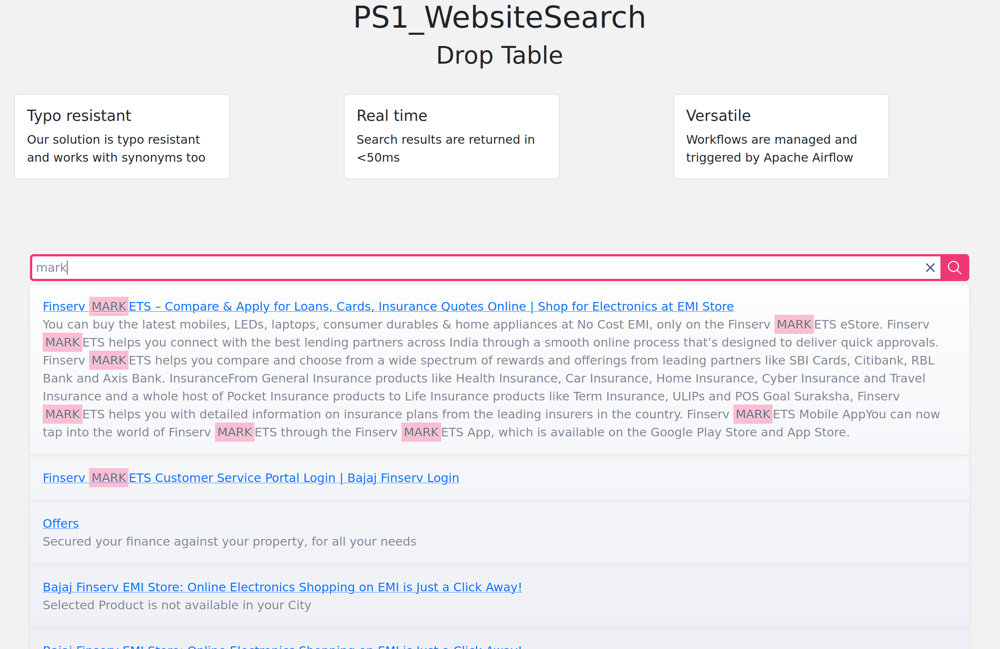

# Website



MeiliSearch has Javascript bindings which can be installed via npm
```bash
npm i meilisearch
```
Note - the field `apiKey` is a random string that can be used to provide some sort of security
```js
import { MeiliSearch } from 'meilisearch';

(async () => {
  const client = new MeiliSearch({
    host: 'http://127.0.0.1:7700',
    apiKey: 'masterKey',
  })

  // An index is where the documents are stored.
  const response = client.index('movies').search('Biscoutte')
})()
```